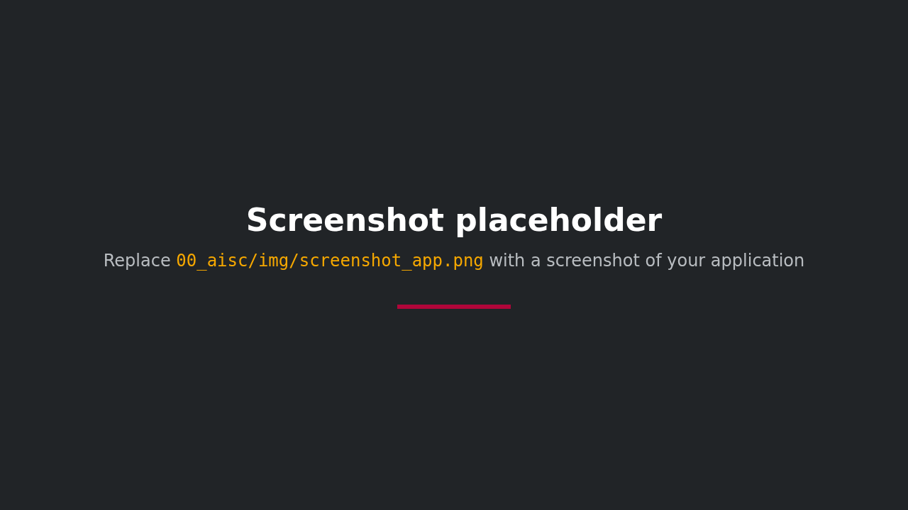

<div style="background-color: #ffffff; color: #000000; padding: 10px;">

<h1> Your title.
</div>

Your project description in two or three sentences: what it does, for whom, and what makes it worth a look.



Replace `00_aisc/img/screenshot_app.png` with a screenshot of your application. Keep the image under the description so it is the first thing a visitor sees after the title; a 1280 by 720 PNG renders well on GitHub.

## Features

- **Key Feature 1**: A description of the Key features
- **Key Feature 2**: A description of the Key features

## Setup and Installation

### Prerequisites

- Docker and Docker Compose
- NVIDIA GPU with CUDA support (optional, but recommended for faster performance)

### Quick Start

1. Clone the repository:
   ```bash
   git clone ...
   cd ...
   ```

2. Run the setup or install dependencies:
   ```bash
   chmod +x setup.sh
   ./setup.sh
   ```

3. Access the application:
   - Frontend: ...
   - Backend API: ...

## User Guide

### Using the Tool
1. A brief description of using the tool.
2. Be clear and simple.

### Recommendations
Any additional hints for using the tool.


## Limitations

- **Limitation 1**: List of Limitations
- **Limitation 2**: List of Limitations


## References

- [Reference 1](https://hpi.de/kisz)
- [Reference 2](https://hpi.de/kisz)

## Author
- [Your Name](https://hpi.de/kisz)

## Issues and the project board

`.github/workflows/add-issue-to-project.yml` adds every new issue to the [AIHPI project board](https://github.com/orgs/aihpi/projects/3). It needs a token in the secret `ADD_ISSUE_TO_PROJECT`, because the workflow's own `GITHUB_TOKEN` cannot write to organisation projects.

- **Public repository**: nothing to do, the organisation-level secret is inherited.
- **Private repository**: organisation secrets are not available to private repositories on the organisation's GitHub plan, so set the secret once after creating the repository. Ask an organisation admin for the token file, then run `gh secret set ADD_ISSUE_TO_PROJECT -R aihpi/<repository> < path/to/token-file`.

Until the secret exists, the workflow fails on every new issue with `Input required and not supplied: github-token`. Nothing else is affected.

## License


---

## Acknowledgements


The [AI Service Centre Berlin Brandenburg](http://hpi.de/kisz) is funded by the [Federal Ministry of Research, Technology and Space](https://www.bmbf.de/) under the funding code 16IS22092.
